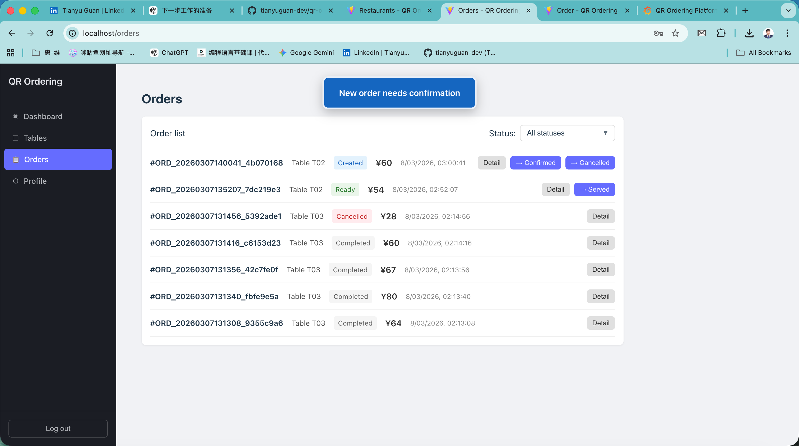
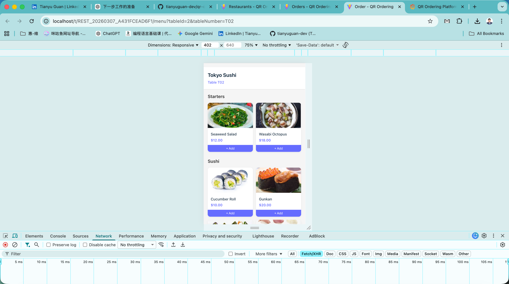
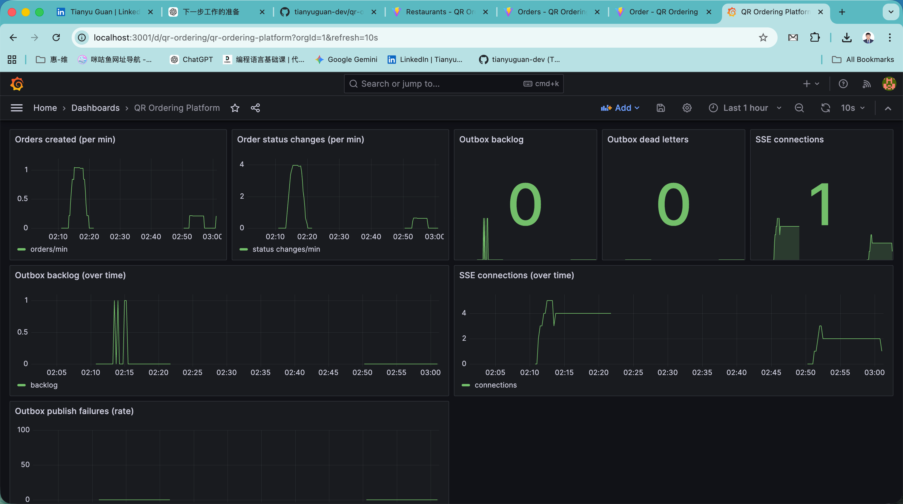

# QR Ordering Platform

[](https://github.com/tianyuguan-dev/qr-ordering-platform/actions/workflows/ci.yml)

Multi-tenant QR code ordering platform for restaurants. Customers scan a table QR code to browse the menu and place orders from their phone. Kitchen and waiter staff manage orders in real time through role-specific dashboards.

**Stack**: Spring Boot 3 · PostgreSQL · Redis · MinIO · Vue 3 · Vite · Docker

---

## 1. Architecture

```
Customer (browser)          Staff (browser)
      │                          │
      │ HTTP (public API)        │ HTTP + SSE
      ▼                          ▼
┌─────────────────────────────────────┐
│           Spring Boot 3 API         │
│  ┌──────────┐  ┌─────────────────┐  │
│  │ REST API │  │  SSE Controller │  │
│  └────┬─────┘  └────────┬────────┘  │
│       │                 │           │
│  ┌────▼─────────────────▼────────┐  │
│  │    OrderService / domain      │  │
│  └────┬──────────────────────────┘  │
│       │ writes outbox_events        │
│  ┌────▼──────────┐                  │
│  │  OutboxProcessor (every 2s)   │  │
│  └────┬──────────┘                  │
└───────┼─────────────────────────────┘
        │ publish
        ▼
     Redis Pub/Sub
        │ subscribe
        ▼
  OrderEventConsumer
        │ broadcast
        ▼
  SseEmitterManager ──► SSE stream ──► Staff browsers
```

**Backend** (`/backend`):
- Spring Boot 3 REST API, multi-tenant by `tenantId` on all domain entities
- Outbox pattern: business logic writes to `outbox_events` in the same DB transaction; a scheduler polls and publishes to Redis
- SSE fan-out: `SseEmitterManager` broadcasts per-restaurant order events to connected staff
- Role-based access control: `PLATFORM_ADMIN`, `RESTAURANT_ADMIN`, `WAITER`, `KITCHEN`
- Flyway schema migrations, MinIO for image storage (logos, dish photos)
- Prometheus metrics + custom health indicator

**Frontend** (`/frontend`):
- Vue 3 SPA, role-specific layouts and navigation
- Global `useOrderEvents` composable — single `EventSource` for the whole app, injected via `provide/inject` so any view can react to order events without re-subscribing
- `sessionStorage` for auth — multiple tabs with different roles (waiter + kitchen) don't overwrite each other

---

## 2. Screenshots

**Staff dashboard — real-time order notification**


**Customer ordering page (mobile)**


**Grafana observability dashboard**


---

## 3. Quick start (Docker, one command)

Requires only Docker + Docker Compose — no JDK or Node.js needed.

```bash
docker compose up -d
```

Images are pre-built and pulled from Docker Hub. All services start in ~30 seconds.

| Service | URL | Credentials |
|---|---|---|
| Frontend (Vue SPA) | http://localhost | see §9 |
| Backend API | http://localhost/api | — |
| Grafana | http://localhost:3001 | admin / admin |
| Prometheus | http://localhost:9090 | — |
| MinIO console | http://localhost:9001 | minioadmin / minioadmin |

**Demo data is seeded automatically on first startup** — two restaurants (Tokyo Sushi and Sichuan Hotpot), each with owner / waiter / kitchen accounts, a full menu with images, and tables. No manual setup required. See §9 for the demo walkthrough.

---

## 4. Local development (hot-reload)

### 4.1 Prerequisites

- JDK **17+**
- Node.js **18+**
- Docker + Docker Compose

### 4.2 Start infrastructure

```bash
# Start only infra (postgres, redis, minio, prometheus, grafana)
docker compose up -d postgres redis minio prometheus grafana
```

| Service | Local address |
|---|---|
| PostgreSQL | `localhost:5432` (db: `qr_ordering`, user: `admin`, pass: `password`) |
| Redis | `localhost:6379` |
| MinIO | `http://localhost:9000` (console: `http://localhost:9001`) |
| Prometheus | `http://localhost:9090` |
| Grafana | `http://localhost:3001` (admin / admin) |

### 4.3 Run backend

```bash
cd backend
mvn spring-boot:run
```

- API base: `http://localhost:8080/api`
- Prometheus endpoint: `http://localhost:8080/api/actuator/prometheus`

### 4.4 Run frontend

```bash
cd frontend
npm install
npm run dev
```

- Dev server: `http://localhost:5173` (proxies `/api` → `http://localhost:8080`)

---

## 5. Technical highlights

### 5.1 Outbox pattern & real-time flow

Why not publish to Redis directly from the service layer? Direct publishing breaks atomicity — if Redis is down or the app crashes after saving the order but before publishing, the event is lost. The Outbox pattern writes the event to the same DB transaction as the business change, so events are never lost regardless of downstream failures.

- `outbox_events` table written inside the business transaction
- `OutboxProcessor` (scheduled every 2s) polls `STATUS_NEW` rows and publishes to Redis
- Idempotency: `processed_events` table prevents double-delivery if the processor crashes between Redis publish and DB commit
- Dead-letter after 5 failed attempts with exponential back-off

### 5.2 SSE vs WebSocket

SSE is unidirectional (server → client), which is all that's needed here — clients send orders via REST, staff only need to *receive* notifications. SSE is simpler to proxy (plain HTTP), works natively in browsers without a library, and reconnects automatically.

`SseController` accepts the JWT in a `?token=` query param (browsers can't set headers on `EventSource`).

### 5.3 Multi-tenant isolation

Every domain entity carries a `tenantId`. All queries are scoped to the tenant derived from the JWT, enforced in the service layer. Platform admin endpoints use a separate path prefix and role check.

### 5.4 Order state machine

```
CREATED → CONFIRMED → PREPARING → READY → SERVED → COMPLETED
                  └──────────────────────────────────► CANCELLED
```

Transitions are validated in `OrderStateMachine`; each role can only trigger transitions it owns (e.g. kitchen cannot confirm, waiter cannot mark ready).

### 5.5 UX details

- Waiter / Restaurant admin: toast on new order ("New order needs confirmation") and when order is ready ("Order ready, please serve")
- Kitchen: toast on confirmed order ("Order confirmed, please prepare") and when a confirmed/preparing order is cancelled ("Order cancelled, please discard")
- Orders list: multi-select status filter, persisted to `localStorage` per user (`ordersFilterStatuses_{userId}`) so different staff keep independent filter preferences
- SSE reconnect: on backend restart the `connected` event bumps `lastConnectedAt`, which triggers an automatic orders reload in the view

---

## 6. Observability

- **Metrics** (`MetricsService`): `orders.created`, `orders.status.changed`, `outbox.backlog`, `outbox.dead`, `outbox.publish.failed`, `sse.connections`
- **Health**: custom `OutboxHealthIndicator` at `/api/actuator/health` with backlog and dead-letter counts
- **Logging**: `MdcFilter` injects `traceId` per request; business code adds `tenantId` and `orderId` to MDC; structured output via `logback-spring.xml`
- **Grafana dashboard**: provisioned at startup — panels for order rate, outbox backlog, dead letters, active SSE connections

---

## 7. Testing

### 7.1 Backend (JUnit + Spring Test)

```bash
cd backend && mvn test
```

**Pure unit tests** (no Spring context):
- `OrderStatusTest`, `OrderStateMachineTest` — enum and state machine logic
- `UserRoleTest`, `JwtServiceTest`, `AuthConverterTest` — auth/JWT round-trips

**Mocked unit tests** (Mockito; skipped on JDK 25+ due to ByteBuddy):
- `OrderServiceTest`, `OrderControllerTest` — service logic and REST contract
- `RestaurantServiceTest` — CRUD routing, duplicate-name handling
- `JwtPrincipalConverterTest` — token claim conversion

**Integration tests** (Testcontainers, real PostgreSQL 15 + Redis 7; runs in CI):
- `RestaurantServiceIntegrationTest` — Flyway migration, JPA `AttributeConverter`, full CRUD round-trip

### 7.2 Frontend (Vitest + Vue Test Utils)

```bash
cd frontend && npm run test:run
```

- **API layer**: `orders`, `auth`, `restaurants`, `menu`, `tables` — URL building, HTTP methods, payloads
- **Composables**: `useOrderEvents` — shape and no-SSE-in-tests contract
- **Components**: `LoginView` — rendering, validation, success/error flows

---

## 8. Project structure

```
backend/src/main/java/com/qrordering/
  auth/          # JWT, security config, user roles
  restaurant/    # Restaurant CRUD, tenant management
  menu/          # Categories & menu items
  table/         # Tables, QR code generation, checkout
  order/         # Orders, state machine, idempotency
  publicapi/     # Unauthenticated customer API (QR scan)
  event/         # Outbox entities, processor, Redis publisher/consumer
  sse/           # SSE controller and emitter manager
  storage/       # MinIO image upload
  observability/ # Metrics, health indicator, MDC filter
  common/        # Exceptions, DTOs, global exception handler

frontend/src/
  api/           # HTTP clients
  composables/   # useOrderEvents (global SSE)
  layouts/       # Role-based dashboard layout
  views/         # All screens
  router/        # Vue Router with role guards

```

---

## 9. Demo walkthrough

### Start

```bash
docker compose up -d
# Frontend: http://localhost  |  Grafana: http://localhost:3001
```

### Step 1 — Get the restaurant Tenant ID

1. Go to http://localhost → login: **Tenant ID** `PLATFORM`, username `admin`, password `admin123`
2. Go to **Restaurants** → copy the **ID** of Tokyo Sushi (e.g. `REST_abc123`)

### Step 2 — Open four tabs

Each tab keeps its own session via `sessionStorage`.

| Tab | Tenant ID | Username | Password |
|-----|-----------|----------|----------|
| Platform admin | `PLATFORM` | `admin` | `admin123` |
| Restaurant admin | `REST_…` | `owner` | `owner123` |
| Waiter | `REST_…` | `waiter` | `waiter123` |
| Kitchen | `REST_…` | `kitchen` | `kitchen123` |

In the **restaurant admin tab**: go to **Tables** → click **Customer view** on any table row → the ordering page opens in a new tab (no phone needed).

### Step 3 — Real-time order flow

Place an order in the customer view:

- **Waiter tab**: toast "New order needs confirmation" appears immediately
- Waiter clicks **Confirm** → **Kitchen tab**: toast "Order confirmed, please prepare"
- Kitchen clicks **Ready** → **Waiter tab**: toast "Order ready, please serve"

### Step 4 — Observability

Open Grafana at http://localhost:3001 → **QR Ordering Platform** dashboard. Place a few more orders and watch the panels update in real time: order rate, outbox backlog, dead-letter count, active SSE connections.
